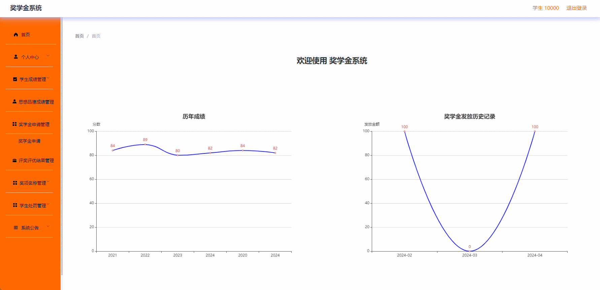

# scholarship🎂

基于SpringBoot+Vue的高校奖学金系统

## 介绍🌞

> 系统后端采用了Spring Boot框架，并结合MySQL数据库，为系统的构建提供了坚实支撑。系统不仅包括了用户管理、奖学金类型管理、奖学金申请管理和学生成绩管理等核心功能模块，同时在数据保护和用户操作便捷性上做了特别设计。

## 软件架构

+ 学生用户：学生用户是系统的主要使用者，他们需要执行奖学金申请、查看申请状态以及了解获奖情况等操作。
+ 教师用户的主要职责是对学生的奖学金申请进行初审
+ 理员负责对所有教师初审通过的奖学金申请进行最终审核并维护管理系统，包括奖学金类别的设置及用户管理等功能

## 项目演示🌞

> 管理员


> 教师


> 学生



## 安装教程🌞

```
1. 运行环境准备mysql8 + java8 + node14.16.1 

2. 配置maven路径，加载依赖

3. 运行sql文件，确保application.yml或config.properties的数据库名称和账号密码是数据库所在主机的账号密码
```


## 使用说明🌞

```
1. 登入

	管理员账号：admin 密码：123456
	
	老师账号：zhangsan 密码：123456

	学生账号：10000 密码：123456
  
2. 运行流程

SpringBoot+Vue项目的部署详情可以查看这篇CSDN博客：http://t.csdnimg.cn/kpuxS

前后端不分离项目的部署流程可以查看这篇CSDN博客：http://t.csdnimg.cn/CslA5
```


## CSDN项目合集🌞

点击前往：http://t.csdnimg.cn/Q4u84


## 联系我🌞

**有偿获取完整源码或调试代码**

🐧：1902317191

微信：


